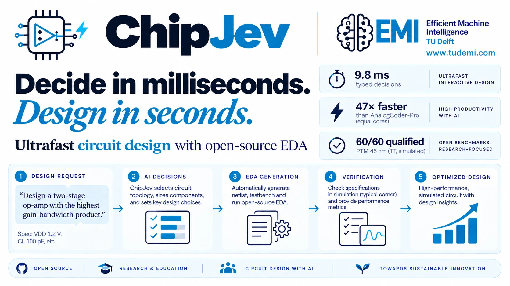

<p align="center">
  
</p>

# ChipJev

**Ultrafast circuit design with a System One model and open-source EDA.**

> **[Watch the live circuit demo →](https://chipjev.com/)**
> Choose a SKY130 design prompt. Each run executes Laya typed decisions and fresh
> topology/sizing search, streams the connected circuit in xschem, and measures it
> with ngspice, generates a real Magic/GDS layout, extracts distributed RC, and
> verifies its post-layout function and performance. CUDA accelerates Laya and
> acquisition; the site reports the actual
> device, phase timings, waveforms and qualification. The default prompt requires
> a complex two-stage op-amp with at least 13 MOSFETs.
> [Run or deploy the demo](deploy/chipjev/README.md).

Source code, recorded experiments and reproducible circuit-design tools. The manuscript is maintained separately.

> ChipJev's decision model is [**ChipLaya**](https://github.com/lab-emi/ChipLaya), our fine-tune of
> the [**Laya**](https://github.com/NandhaKishorM/laya) decision model by Convai Innovations, run
> through a PyTorch port of [**Laya-MLX**](https://github.com/mizorewww/laya-mlx). ChipLaya's model,
> runtime, weights and model card live in their own repository; this repository is the design agent
> around it ([ChipJev and ChipLaya](#chipjev-and-chiplaya)). We thank the Laya, Laya-MLX and mmBERT
> authors; see [Acknowledgments](#acknowledgments) and [Citation](#citation).

Large language model (LLM) flows such as AnalogCoder-Pro design circuits as a slow *System Two*:
they write netlists token by token, repair them and size every candidate with a thousand
simulations. ChipJev applies the *System One* paradigm of TypeSafe's
[Jev](https://typesafe.ai/blog/introducing-system-one-models-and-jev) (unstructured state in,
typed probabilistic decisions out, in one parallel pass) to circuit design:

1. **System One decisions.** ChipLaya, an open System One decision model (Laya fine-tuned on
   development data), answers closed-option questions about a design request (input stage, stage count,
   compensation, ...) on the GPU in about 10 ms. Every option is a symbol of a 4,562-topology
   grammar, so every answer is a valid circuit.
2. **GPU search.** The answers form a prior that seeds a joint topology and sizing search:
   constraint-aware Gaussian processes, pathwise Thompson sampling in a fused Triton kernel and
   eight parallel ngspice workers.
3. **Open-source EDA.** ngspice measures every design on PTM 45-nm models or the open SKY130
   PDK; only strictly qualified designs count (op-amps must also work as closed-loop unity
   buffers), and SKY130 designs export to xschem with the PDK's symbols.

## Results

The schematic benchmark results below come from frozen, preregistered studies
and are regenerated from the archived
evidence by one command ([Reproduce the experiments](#reproduce-the-experiments)).

- **Versus AnalogCoder-Pro** ([PTM 45 nm study](experiments/ptm45/README.md): AnalogCoder-Pro's
  twelve tasks). ChipJev qualifies **60/60** runs in **9.3 s** median. AnalogCoder-Pro's
  released LLM flow needs 1.0 h of attempt time per task (7.8 min with eight attempts in
  parallel) and qualifies designs for 5 of 12 tasks with DeepSeek-V3 and 3 with GPT-5-mini, none
  of them an op-amp. At equal cores ChipJev is **47× faster** (380× against the summed attempt
  time), with up to **7.5× the FoM**, 7.1× the GBW and **39 dB more gain**.
- **Versus Bayesian optimization.** Eight-worker joint TPE qualifies 51/60 runs and random search
  33/60; ChipJev reaches TPE's final quality **3.6× sooner**.
- **Open SKY130 PDK** ([SKY130 study](experiments/sky130-system-two/README.md)). ChipJev qualifies **60/60** runs
  (TPE 51/60, random 24/60), loses no task against TPE's medians and reaches TPE's final quality
  **4.5× sooner**; all 135 qualified designs export to xschem.
- **System One versus System Two** ([same study](experiments/sky130-system-two/README.md)). ChipLaya answers a
  request's typed questions in **9.8 ms**; DeepSeek-V3 and GPT-5-mini answering the same
  questions take 8.0 s and 16 s (**820–1,600× slower**) and give no better designs.

The separate [physical demonstration](experiments/layout/README.md) adds Magic DRC, Netgen LVS,
distributed RC PEX and strict post-layout ngspice for the three live prompts.
[Measured timings and evidence](experiments/layout/report/README.md) distinguish final-layout
time, the full physical flow including recovery, and the entire live run.

## Repository layout

```text
ChipJev/
├── src/chiplaya/                ChipLaya, the decision model, vendored from lab-emi/ChipLaya (CHIPLAYA.json)
│   ├── laya_torch.py            Laya on CUDA, MPS or CPU: PyTorch port of Laya-MLX (Apache-2.0)
│   ├── schema.py                the typed design questions and option cards
│   ├── model.py, weights.py     loading a release; the released weights and their SHA-256
│   └── finetune.py              templates, trainer and parsing evaluation
├── src/chipjev/                 the ChipJev package (command line: chipjev)
│   ├── decisions/               typed decisions
│   │   ├── typed.py             ChipLaya's answers as a prior over the topology grammar (System One)
│   │   ├── finetune.py          grammar labels from development searches for fine-tuning
│   │   ├── llm.py               System Two baseline: an LLM answers the same questions
│   │   └── layout*.py, pro_layout.py  layout decisions over knowledge cards
│   ├── circuits/                grammar of 4,562 topologies, joint topology-and-sizing space,
│   │                            AnalogCoder-Pro's published topologies, SKY130 devices
│   ├── simulation/              ngspice testbenches: shared measurement, PTM 45 nm, SKY130,
│   │                            corners and mismatch, the pinned SKY130 models
│   ├── surrogate/               batched Gaussian processes, fused Triton Thompson kernels
│   ├── search/                  ChipJev search loop, ngspice worker pool, TPE and random search
│   ├── analogcoder_pro/         AnalogCoder-Pro's sizing helper and netlist adapter, reconstructed
│   ├── cli.py, __main__.py      chipjev decide | design | tasks (also python -m chipjev)
│   ├── tasks.py, tasks.json     AnalogCoder-Pro's twelve benchmark tasks (a frozen input)
│   ├── paths.py, provenance.py  repository and tool locations; runtime records
│   └── xschem.py                xschem schematics of SKY130 designs
├── experiments/
│   ├── ptm45/                   PTM 45-nm study: protocol, deviations, fine-tuned weights,
│   │                            development record, results/ (evidence), report/
│   ├── sky130-system-two/       SKY130 and System Two study: protocols, deviations,
│   │                            results/ (evidence), report/, xschem/ (exported schematics)
│   └── README.md                study index; map from the frozen names to the package
├── reproduce/
│   ├── reproduce-paper.sh       verify and regenerate reports (--rerun: every experiment)
│   ├── verify.py                checks protocols, weights, evidence and supplied source snapshots
│   ├── frozen-code.json         original source snapshot provenance, hash and member list
│   ├── frozen.py                rebuilds and runs locally supplied source snapshots
│   ├── README.md                optional source archive paths and reproduction requirements
│   └── report_*.py              evidence archives to the paper's macros, tables and Fig. 2
├── scripts/                     setup.sh (environment, models, ngspice 47), setup-analogcoder-pro.sh,
│                                sync_chiplaya.py (checks and updates the vendored ChipLaya)
├── tests/                       pytest suite, including frozen-versus-package equivalence
├── assets/chipjev-banner.png    README banner
├── CHIPLAYA.json                the pinned ChipLaya release: tag, commit, file and weights SHA-256
├── CITATION.cff                 citation metadata, including ChipLaya, Laya, Laya-MLX and mmBERT
├── NOTICE, LICENSES/            Apache-2.0 notices and licenses for the Laya- and mmBERT-derived parts
├── LICENSE                      Apache-2.0
├── THIRD_PARTY_NOTICES.md       provenance of third-party code, models and tools
└── pyproject.toml, uv.lock      locked Python environment
```

Each study keeps its preregistered protocol (`PROTOCOL.md`, `protocol.json`), deviations
(`DEVIATIONS.md`) and a checksummed evidence archive (`results/`, `MANIFEST.json`). The studies
were frozen as protocols topo-v3 and topo-v4 before the code was organized by function. The
exact code they hashed and ran is recorded by `reproduce/frozen-code.json`. Its source
snapshot and the studies' `frozen-source.tar.gz` snapshots are optional local inputs, excluded
from Git; [reproduce/README.md](reproduce/README.md) lists their paths and checksum records.
With those files supplied, reruns execute the original code (`reproduce/frozen.py`).
`tests/test_equivalence.py` compares the package with the recorded golden output on the same
inputs; [experiments/README.md](experiments/README.md) maps the names.

## Goal-driven analog layout

The Magic → distributed RC PEX → ngspice flow now searches explicit layout plans: matching groups, guard domains and taps, current-based rails, unit decomposition, grounded separators and physical decap. ChipLaya proposes legal actions; full DRC/LVS and fixed-bias simulation decide acceptance. The demo shows iteration history, parasitic balance, noise, PSRR and supply measurements. See [commands, coverage and limitations](docs/analog-layout-usage.md).

The [three measured development runs](experiments/analog-layout/report/README.md) include native geometry, every evaluated layout and raw verification evidence. Their complete layout loops take 19.24–38.52 s on the recorded host; area falls by 34.2% and 13.9% for two cases, while the wideband case retains its initial feasible layout. These are development regressions, not held-out success rates or a comparison with dedicated layout tools.

## ChipJev and ChipLaya

ChipJev is the circuit design agent; [ChipLaya](https://github.com/lab-emi/ChipLaya) is its
decision model, developed and released in its own repository with its model card.

| | ChipJev (this repository) | [ChipLaya](https://github.com/lab-emi/ChipLaya) |
|---|---|---|
| Role | the design agent: topology grammar and prior, GPU topology/sizing search, EDA verification, layout loop, experiments, live demo | the System One model: typed questions, Laya runtime, fine-tuning code, released weights, model card |
| Code | `src/chipjev`, `demo/`, `reproduce/` | `src/chiplaya`, vendored here |
| Weights | runs `experiments/ptm45/typed-decisions.pt`, the frozen studies' file | publishes it as weights release v1.0.0 (same bytes, plus a safetensors copy) |

- ChipJev vendors `src/chiplaya/` byte for byte from a ChipLaya release tag and pins it in
  [`CHIPLAYA.json`](CHIPLAYA.json): the tag, its commit and the SHA-256 of every file and of the
  weights. A package dependency would change `uv.lock`, which the frozen protocols hash, and the
  demo host runs offline.
- `python scripts/sync_chiplaya.py --check` verifies the pin offline (in the website CI);
  `--check --upstream --latest` also verifies it against GitHub and reports newer releases
  (weekly, [`.github/workflows/chiplaya.yml`](.github/workflows/chiplaya.yml));
  `--update vX.Y.Z` vendors another release.
- [`tests/test_chiplaya.py`](tests/test_chiplaya.py) ties the release to the frozen evidence:
  ChipLaya's `laya_torch.py` is byte-identical to the protocols' Laya runtime, its v1.0.0 weights
  are the protocols' weights, and its questions cover every decision of the topology grammar.
  ChipLaya's own CI checks that ChipJev's pinned copy equals the tagged sources.
- `chipjev decide` and the [live demo](https://chipjev.com/) report the ChipLaya release they run.
- Do not install the separate `chiplaya` package into ChipJev's environment: `chipjev.decisions`
  refuses any `chiplaya` other than the vendored copy.

## Getting started

**Requirements.** Linux x86-64 with git, [uv](https://docs.astral.sh/uv/getting-started/installation/),
gcc and make (ngspice is built from source); and an NVIDIA GPU with a CUDA 13 driver
(the same code runs on the CPU, much slower). Rerunning the experiments also needs
bubblewrap, an [OpenRouter](https://openrouter.ai/) API key, and xschem with the sky130A
xschem library.
Use the Python 3.13 that uv manages (the `uv.lock` hashed by the protocols requires it); do not
create a separate pip or Conda environment or copy `.venv/` or `.tools/` between machines. On
Ubuntu with a new kernel, CUDA needs the NVIDIA module package of the running kernel (for
example `linux-modules-nvidia-580-open-$(uname -r)`).

**Install.**

```bash
git clone https://github.com/lab-emi/ChipJev.git
cd ChipJev
scripts/setup.sh   # Python 3.13, the locked CUDA environment, Laya, SKY130 models, ngspice 47
```

`scripts/setup.sh --install-system-packages` installs the build dependencies with the system
package manager (sudo); `--xschem` also builds xschem 3.4.7 into `.tools/`.

**Typed decisions.** ChipLaya answers the typed questions of a design request, with the
fine-tuned weights of the paper (ChipLaya's v1.0.0 weights, run by the vendored v1.0.1):

```bash
.venv/bin/chipjev decide "Design a two-stage op-amp with the highest gain-bandwidth product" \
  --vdd 1.2 --load 100
```

```text
typed decisions: ChipLaya v1.0.1 (.../typed-decisions.pt) on cuda (NVIDIA GeForce RTX 4090)
class opampN, objective gbw (parsed); topology prior over 1620 opampN topologies for gbw, ...
  first           ota5 0.61, tele 0.25, cmota 0.08, fc 0.04, rload 0.03
  count           2 0.77, 3 0.23
  comp            miller 0.50, none 0.34, miller_rz 0.11, miller2 0.05
most probable topologies:
  0.094  ota5_n+cs_n+miller
  0.065  ota5_n+cs_n
  ...
```

**Design a circuit.** `chipjev design` runs the typed decisions and a ChipJev search with the
settings of the paper (1,024 simulations, eight ngspice workers, strict qualification), then
writes the qualified design (`circuit.spice`), its testbench deck (`testbench.spice`) and the
full record (`result.json.gz`) to `runs/designs/`:

```bash
.venv/bin/chipjev tasks                                   # AnalogCoder-Pro's twelve tasks
.venv/bin/chipjev design --task opampN-gbw                # one run of the paper's protocol, ~15 s
.venv/bin/chipjev design --task opampN-gbw --technology sky130
.venv/bin/chipjev design "Design a folded-cascode op-amp with maximum gain" --vdd 1.2 --load 10
.venv/bin/python -m pytest -q                             # tests (ngspice 47 from .tools/bin)
```

Searches on a GPU are not bit-reproducible under a seed (background hyperparameter refits,
GPU arithmetic), so single runs vary; the paper reports medians over five seeds.

**Generate and verify a physical layout.** Install the local pinned Magic with
`bash scripts/setup-layout.sh` (requires LVS Netgen and the build dependencies described
in [the physical flow](experiments/layout/README.md)), then:

```bash
.venv/bin/chipjev layout runs/designs/opampN-gbw-sky130-s0/result.json.gz --output runs/physical
```

The output contains native Magic, GDSII, DRC/LVS reports, the actual RC-extracted netlist,
strict post-layout measurements and every bounded recovery attempt. A failed result exits
with a nonzero status. The CLI requires a SKY130 result; PTM sizing is not silently converted.

The default layout generator (`--generator pro`) compiles professional analog-layout
practice into templates: shared-diffusion finger arrays with end dummies, 1-D and 2-D
cross-coupled common-centroid pairs, rows along the DC current path with tapped rails, guard
rings and a double guard bar, a metal3 power grid, decoupling fill, unit-tile MIM and poly
resistor arrays, and mirror-symmetric trunk/bus routing. A goal-driven loop verifies candidate
plans in parallel (DRC, LVS, RC, the declared physical netlist, post-layout ngspice, a rule-card
critic) with Laya ranking actions whose option text carries the knowledge cards retrieved for
that action. `--finger-max UM` on `chipjev design` sizes SKY130 devices with the layout's unit
finger. Design, measurements and the knowledge-base/fine-tuning study:
[docs/analog-layout-pro.md](docs/analog-layout-pro.md).

## Reproduce the experiments

```bash
reproduce/reproduce-paper.sh           # from the archives: minutes, no GPU or API key needed
reproduce/reproduce-paper.sh --rerun   # needs optional source snapshots; about 15 h and $12 of API calls
```

**From the archives (default).** The script installs the tools (`--skip-setup` uses existing
tools), checks protocols, weights and evidence, re-simulates the recorded designs and
regenerates the study summaries, tables and figures under `runs/reports/`. It does not need
the manuscript. Source snapshot bytes and frozen runners are checked when all three optional
archives are installed; their absence is reported explicitly.

**Rerun (`--rerun`).** Restore the optional source snapshots listed in
[reproduce/README.md](reproduce/README.md) and verify them with
`python3 reproduce/verify.py --require-frozen`. The script executes the frozen PTM 45 nm,
SKY130 and System Two protocols and writes fresh reports to `runs/rerun/reports/`.
It requires a CUDA GPU, CPU ids 0–15, bubblewrap, xschem with the sky130A library and
`OPENROUTER_API_KEY`. On the study's Ryzen 9 7950X and RTX 4090, a full rerun takes about
15 hours and $12 in API calls. Finished searches resume from their journals. Runs are not
bit-identical under a seed; compare medians and intervals with the archived evidence.

| Paper item | Evidence | Written by |
|---|---|---|
| Table I, Fig. 2 | `experiments/ptm45/results/` (`main/`, `acpro-llm/`) | `reproduce/report_ptm45.py` |
| Table II | `experiments/ptm45/results/acpro-llm/`, `experiments/sky130-system-two/results/system2/` | both reports |
| Table III | `experiments/sky130-system-two/results/sky130/` | `reproduce/report_sky130_system_two.py` |
| Numbers in the text (`generated/ptm45-summary.tex`, `sky130-system-two-summary.tex`) | both archives | both reports |

## Acknowledgments

- **[Laya](https://github.com/NandhaKishorM/laya)** by Convai Innovations and the Laya
  contributors (Apache-2.0) is the typed decision model that ChipLaya fine-tunes. The checkpoint
  is a conversion of its multilingual model
  [`convaiinnovations/laya-multilingual`](https://huggingface.co/convaiinnovations/laya-multilingual)
  (revision `052592a1`).
- **[Laya-MLX](https://github.com/mizorewww/laya-mlx)** by the Laya-MLX contributors (version 0.1.0,
  commit `fc1df628`, Apache-2.0) is the runtime we build on.
  [`src/chiplaya/laya_torch.py`](src/chiplaya/laya_torch.py) ports its inference path to PyTorch
  for CUDA: question rendering, token sequences, confidence and calibrated option scoring, and
  its ModernBERT-architecture encoder and Laya decision head. We run the FP16 conversion
  published for Laya-MLX, [`aac6fef/laya-multilingual-mlx`](https://huggingface.co/aac6fef/laya-multilingual-mlx)
  (revision `f2b4faf5`). Laya-MLX's notice and our changes are in [NOTICE](NOTICE), its license in
  [LICENSES/Apache-2.0.txt](LICENSES/Apache-2.0.txt).
- **[mmBERT](https://huggingface.co/jhu-clsp/mmBERT-base)** by Marone, Weller, Fleshman, Yang,
  Lawrie and Van Durme (MIT, [arXiv:2509.06888](https://arxiv.org/abs/2509.06888)) is the encoder
  the Laya checkpoint is built on ([LICENSES/MIT-mmBERT.txt](LICENSES/MIT-mmBERT.txt)).
- TypeSafe AI's [Jev](https://typesafe.ai/blog/introducing-system-one-models-and-jev) introduced
  the System One framing that ChipJev follows. Jev itself is not used, and ChipJev and ChipLaya
  are independent academic projects, not affiliated with or endorsed by TypeSafe AI or Convai
  Innovations.
- [AnalogCoder-Pro](https://github.com/laiyao1/AnalogCoderPro) (commit `05542af`, run unchanged and
  not redistributed) is the LLM baseline. [ngspice](https://ngspice.sourceforge.io/),
  [xschem](https://github.com/StefanSchippers/xschem), the
  [SKY130](https://github.com/google/skywater-pdk) models (via
  [AnalogGym](https://github.com/CODA-Team/AnalogGym)) and the [PTM](https://ptm.asu.edu/) 45-nm
  model cards form the open EDA stack; see [THIRD_PARTY_NOTICES.md](THIRD_PARTY_NOTICES.md).
- This work was partially supported by the Dutch Research Council (NWO) under the Talent
  Programme Veni 2023 scheme in Applied and Engineering Sciences (AES), Grant No. 21132.

## Citation

Software metadata is available in [CITATION.cff](CITATION.cff). Please also cite ChipLaya,
ChipJev's decision model, and acknowledge Laya, the laya-multilingual checkpoint, Laya-MLX and
mmBERT, on which it builds:

```bibtex
@software{chiplaya,
  author  = {Gao, Chang and Chen, Qinyu},
  title   = {{ChipLaya}: A Typed Decision Model for Analog Circuit Design},
  year    = {2026},
  version = {1.0.1},
  url     = {https://github.com/lab-emi/ChipLaya}
}

@misc{laya,
  author       = {{Convai Innovations and Laya contributors}},
  title        = {{Laya}: Multilingual, Non-Autoregressive Typed Decision Engine},
  year         = {2026},
  howpublished = {\url{https://github.com/NandhaKishorM/laya}}
}

@misc{layamlx,
  author       = {{Laya-MLX contributors}},
  title        = {{Laya-MLX}: Native {MLX} Runtime for Typed Decision Models},
  year         = {2026},
  note         = {Version 0.1.0, commit fc1df628},
  howpublished = {\url{https://github.com/mizorewww/laya-mlx}}
}

@misc{layamultilingual,
  author       = {{Convai Innovations}},
  title        = {laya-multilingual},
  year         = {2026},
  note         = {Revision 052592a15d198d9ad47da779604259b10b47b7aa},
  howpublished = {\url{https://huggingface.co/convaiinnovations/laya-multilingual}}
}

@misc{mmbert,
  author        = {Marone, Marc and Weller, Orion and Fleshman, William and Yang, Eugene and
                   Lawrie, Dawn and Van Durme, Benjamin},
  title         = {{mmBERT}: A Modern Multilingual Encoder with Annealed Language Learning},
  year          = {2025},
  eprint        = {2509.06888},
  archivePrefix = {arXiv},
  primaryClass  = {cs.CL}
}
```

## License

ChipJev is released under the [Apache License 2.0](LICENSE); so is the vendored ChipLaya
package (`src/chiplaya`). `src/chiplaya/laya_torch.py` and the fine-tuned weights
`experiments/ptm45/typed-decisions.pt` derive from Laya-MLX, Laya and the Laya checkpoint;
those portions remain under the Apache License 2.0 ([NOTICE](NOTICE),
[LICENSES/Apache-2.0.txt](LICENSES/Apache-2.0.txt)). The weights' encoder layers also derive
from mmBERT-base (MIT, [LICENSES/MIT-mmBERT.txt](LICENSES/MIT-mmBERT.txt)). Third-party tools, models and weights keep
their own licenses ([THIRD_PARTY_NOTICES.md](THIRD_PARTY_NOTICES.md)).
