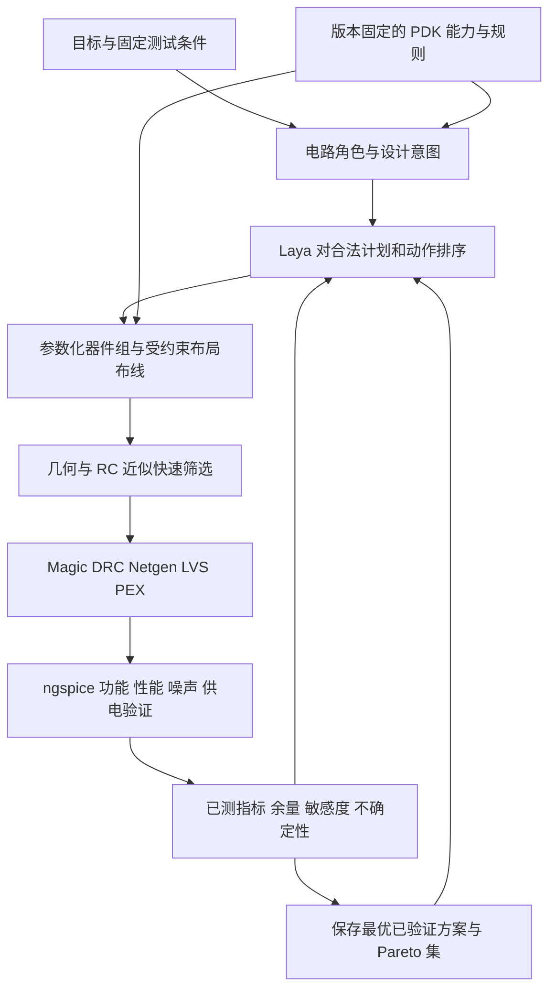

# ChipJev：面向专业模拟版图的目标驱动闭环

日期：2026-09-26。原始设计提案，保留其目标与分阶段范围。PDK adapter、匹配组生成、布局动作闭环、固定偏置模拟测量和专家偏好数据接口现已实现；实际支持范围、限制和命令见 [实现与验收说明](analog-layout-usage.md)。下面的未来要求不能自动视作已验证能力。

## 结论

把搜索对象从 `(topology, sizing)` 扩展为 `(topology, sizing, layout_plan)`。由 Laya 根据电路角色、工艺能力、目标余量和已测反馈，给有限的版图动作排序；由受约束的生成器把动作编译成真实几何；由 DRC/LVS、寄生分析和后仿决定接受、回退和下一步。

专业工程师的 taste 应进入三个位置：可复用的器件组生成器、可检查的设计意图，以及符合目标的方案偏好。最后的判断必须有电气和物理依据。美观评分不能抵消非法几何、连接错误、噪声超标或匹配恶化。

## 1. 当前代码实际做到了什么，缺在哪里

已完成的能力是实际 PDK 几何、DRC/LVS、分布式 RC 提取和标称后仿。`demo/design.py:LayoutEvaluator` 已把严格候选的真实后仿结果带回电路搜索。这是有效的起点，但还没有独立的版图优化自由度。

| 当前实现 | 后果 | 对应改造 |
| --- | --- | --- |
| `layout/magic.py:primitive_specs` 把每个 finger 生成为独立 `nf=1`、`guard=1` PCell | 匹配器件不形成阵列；重复护环、间隔和接触占面积 | 以匹配组为生成单位，规划单元、dummy、tap 和组级护环 |
| `synthesize` 按器件顺序单行排列，相邻 bbox 固定相隔 800 个内部单位，即 4 µm | 没有电路角色、信号流、热源、匹配或紧凑度驱动的 floorplan | 功能分组、二维排列、受约束压缩 |
| 所有网络走固定 M3 主干和 M2 支线；主干 0.50 µm、支线 0.26 µm | 电源与敏感信号没有不同的设计策略，也未按支路电流分配导线/过孔 | 供电网络、敏感网络、普通网络分别规划 |
| `layout/flow.py:complete` 仅尝试邻近 sizing，第一组验证通过就停止 | 不能在同一电路上比较布局、路由、护环、屏蔽、decap | 增加独立的版图计划、合法局部动作和质量改进阶段 |
| `decisions/typed.py` 的问题覆盖拓扑、极性、级数、补偿 | Laya 尚未做物理设计决策 | 新增版图 typed decisions 和相应训练/评估数据 |
| `simulation/sky130.py` 使用理想供电/偏置，并搜索输入工作点；`MC_MM_SWITCH=0`、`MC_PR_SWITCH=0` | 没有供电阻抗下的 decap 评估、失配分布、输入噪声或 PSRR 验收 | 固定工作条件的专业版图测试集 |

归档 OTA 有 5 个逻辑 MOS、39 个物理 finger，尺寸约 296.84 × 61.99 µm，面积 18,401.11 µm²。这能说明当前单行展开的代价，不能据此宣称未来能缩小某个固定比例。数据来自 `experiments/layout/results/ota-efficient/physical.json`。

目前提取结果含真实分布式 RC，但总 R/C 数量、总电容不是版图质量目标。需要知道寄生位于哪个敏感节点、两个匹配路径是否失衡、供电压降出现在何处。

## 2. 分层架构

整个 loop 的状态至少包括：目标/频段/负载/电源条件、电路与布局计划、工艺及生成器版本、合法动作集、当前最差余量、寄生热点、测量保真度、模型不确定性、剩余时间和最佳已验证设计。

### 2.1 PDK 是可查询、可执行的规则层

规则层保存单位、条件、来源、版本和支持状态，覆盖：制造网格、器件尺寸与模型 bin、层与过孔栈、最小宽度/间距/包围、宽线相关间距、well/tap、天线、适用的密度及电气规则。

不能把规则简化为每层一个 `min_space`，也不能让语言模型凭记忆产生数值。采用人工核验的结构化 adapter，配合合法/临界非法几何测试，以固定版本的 Magic tech/PCell 为实际执行基础。跨块拼接后仍要检查 DRC，局部合法不能推出全局合法。

各检查应显式返回 `pass / fail / unsupported / not_run`。例如缺少适用的电迁移限值时，可以做 IR 分析和报告导线电流，但不能把它写成 EM 已通过。区分生成器覆盖的规则、当前 DRC deck 覆盖的规则、需要单独执行的规则以及整芯片级要求。

此设计依据 SKY130 官方规则表中的条件规则和检查标记；参见 [Periphery Rules](https://skywater-pdk.readthedocs.io/en/main/rules/periphery.html) 与 [Antenna Rules](https://skywater-pdk.readthedocs.io/en/main/rules/antenna.html)。

### 2.2 用电路角色表达 analog design intent

现有电路 grammar 已知道输入对、负载镜、级数和补偿结构。第一步应由 builder 保留这些语义，形成稳定的器件/网络角色 ID；对外部网表再补图匹配推断、置信度和人工覆盖接口。

需要表达的意图包括：匹配组与比例、等单元尺寸、方向与边缘环境、对称布线、关键高阻节点、噪声敏感端、强扰动端、供电域、偏置域、允许的扩散共享、端口位置、允许占用的边界和预算。

“相同 W/L”不能自动推出“应匹配”，连接结构对称也不能自动推出电气条件完全相同。按设计意图决定哪些约束必须满足、哪些仅用于候选排序。

ALIGN 已采用显式的器件组、对称器件/网络、护环、屏蔽、供电端口等约束。ChipJev 可借鉴其语义，适配现有 Magic 后端，而不必把模型输出绑定为自由形式 Tcl。[ALIGN constraints](https://align-analoglayout.github.io/ALIGN-public/notes/const.html)

### 2.3 Laya 控制有限、有含义的版图动作

示例动作：

- 输入对选择紧凑对称、交指或二维共质心模式。
- 改变合法的 unit finger 宽度、行列数和 dummy 配置。
- 对完整匹配组做平移、镜像、压缩；不能独立破坏组内对应关系。
- 选择供电层、加宽某一条支路、增加过孔阵列或第二馈电点。
- 缩短高阻节点、平衡特定匹配路径的 R/C 或更换路由层。
- 在允许的供电区域添加/移动/缩减 decap，或给具体敏感网增加屏蔽。

每个动作带适用条件、预期改善、可能代价、预计计算成本和可回退的 plan patch。Laya 输出候选概率，优化器保留探索份额，并通过实测更新；不能把所有条件选项独立采样后假设组合仍合法。

现有 Laya 是文本状态上的 typed-decision 模型，并不是已训练好的几何/图像模型。早期可使用结构化摘要和规则生成的候选，后续再以真实轨迹训练动作偏好。若要输入几何图特征，需要另加编码器或可靠摘要接口。

## 3. 把专业版图考虑转化为动作与评价

### 3.1 供电 rail 和过孔

按 DC 与瞬态支路电流、长度、允许压降及工艺电流限制确定宽度和过孔数量。直线段可先用下面的近似产生候选：

`W >= max(W_DRC, R_sheet * I * length / deltaV_budget, W_current_limit)`

这是粗筛模型。实际决策仍需分布式电阻网、过孔电阻、分流情况和适用的峰值/平均/RMS 条件。加宽还会改变间距、耦合、拥塞和面积；供电线宽不应统一指定一个“专业”数值。

候选应考虑大电流输出级与输入/偏置的回流路径，降低公共阻抗耦合。是否采用分区供电、星形连接或其他结构应服从具体电路和引脚约束，不能默认任意切分地网。tap/guard ring 必须连接到正确且低阻的参考网络。

### 3.2 Decap

将 decap 作为有代价的电路和物理设计变量：器件类型、容值、位置、连接层、接触数量和服务的供电区域。容许区域不仅按几何距离定义，还应考虑到负载的供电/回流阻抗。

先补充供电入口的有限阻抗模型、规定的负载/电流扰动和供电噪声场景，再比较 decap 对 droop、PSRR/供电传递函数、恢复时间和面积的影响。`C ≈ deltaI * deltaT / deltaV` 只能作为粗略候选生成依据，不能替代含 ESR、布线及适用封装模型的验证。

理想电源引脚下已有内部寄生并非完全没有 decap 效应，但现有测试不足以给出合理的 decap 位置和大小目标。任何 PDN/封装假设都必须随结果保存。

新增 decap 必须先作为显式设计变更进入实现网表，并纳入模型、LVS、PEX、面积和功耗账本；不能只画在版图上，或从 LVS/后仿中忽略。

### 3.3 匹配、finger 与 dummy

输入差分对、电流镜和比例阵列采用参数化匹配组。检查相同单元 W/L、方向、接触和端部环境，以及对应 gate/source/drain 的路径差异。共质心首先用于抑制适当空间梯度的差异，不能自动消除随机失配、偏置不同或高阶空间效应。

允许紧凑对称、交指、共质心模式竞争。共质心不应成为所有晶体管的强制默认：额外连线可能损害带宽、引入寄生不平衡或增加面积。已有多目标研究也同时处理离散分布、路由、扩散共享和布局相关效应。[Common-centroid optimization](https://arxiv.org/abs/2407.00817)

随机失配和空间系统误差要分开处理：

- 先验证当前 PDK 的随机模型、独立样本、种子和参数作用域，再做 mismatch Monte Carlo。
- 如测试空间梯度或热梯度，记录模型来源；未经校准的注入模型只能称为敏感性/压力测试。
- 单纯打开无坐标信息的随机失配模型，通常无法评价共质心的空间梯度抵消效果。
- 分 finger 后的随机参数应符合模型面积缩放及相关性假设，避免靠增加独立随机样本数制造虚假的匹配改善。
- dummy 的类型、连接和提取行为必须明确；可提取器件必须进入实现网表和 LVS，不能为了通过验证而盲目删除器件。

`W_total` 相同不意味着分指后的电路模型完全相同。需要维护模型 bin、有效宽度、接触、AD/AS/PD/PS 和适用的布局相关参数的一致性，并实测实际提取网表。不能仅把原先 `nf` 改成更多 finger 就宣称等效。

### 3.4 面积与布线

优先减少重复护环、空白通道和不必要的全局长线：按功能做二维 floorplan，在合法且不破坏匹配的前提下共享扩散/阱/护环，利用兼容的 source/drain 顺序和规则化单元，再做组级压缩。

成本包含最终可集成的 cell bbox、护环、供电、decap、边界余量和适用的填充；不能只统计 active area。密度/填充需要明确检查窗口和芯片集成上下文。最终填充若改变寄生，应重新提取。

匹配与隔离的空间需求属于约束，不能被“面积最小”挤掉。导线越短、过孔越少也不是普适好事：电源冗余过孔和隔离结构可能是必要成本。

### 3.5 噪声、耦合与布局相关效应

需要分开评价：器件热噪声/闪烁噪声、金属耦合、供电/地弹噪声、偏置耦合、基底耦合和布局相关器件效应。

- 使用 ngspice `.noise`，按指定输入源和频段报告输入折算谱密度、积分噪声及主要贡献。差分输入应校验源归一化，避免把半幅输入当成完整差分输入。[ngspice manual](https://ngspice.sourceforge.io/docs/ngspice-manual.pdf)
- 用独立的 PSRR 和 aggressor 注入测试评估供电/互连耦合；CMRR 不能替代它们。
- 屏蔽候选需要良好回流连接，且评估新增电容和带宽代价。
- PEX 要保留相关互连耦合并记录提取配置。[Magic extract reference](https://www.opencircuitdesign.com/~tim/programs/magic/commandref/extract.html)
- 当前流程尚未验证完整基底噪声、热场或 WPE/LOD 等效应的建模覆盖；不能从“有 RC PEX”推导出这些效应已被模拟。暂不支持的部分保留几何约束和明确的评估状态。

### 3.6 专业 taste

先把 taste 拆成可解释特征：一致的单元和栅方向、可辨认的功能分组、合理信号流、相同边缘环境、清楚的供电/回流、关键节点短、端口可达、冗余与留白有原因。

再收集同一个电路和目标下，专家对两个均合法方案的偏好及理由。使用电路角色、几何特征和已测指标训练排序模型，作为 Laya 的提案先验或可行解之间的偏好项。视觉截图可辅助人工审查，但当前 Laya 不是视觉审图器，也不能让“看起来对称”替代寄生和匹配测量。

## 4. 真正的目标驱动迭代

### 4.1 明确 goal contract

将原有 gain/GBW/FoM 扩展为：性能目标、面积/功耗上限、噪声频段与上限、offset/失配要求、PSRR 频率范围、供电压降、固定输入共模/偏置、PVT 条件及计算预算。

用户没有给出的噪声或良率指标不应自动变成某个数值上的“已达标”。可以记录测量并展示 trade-off，但区分未指定目标与验收要求。

原有输入工作点搜索可保留为明确的探索模式；版图间公平比较应固定共同工作条件。若允许 trim/calibration，则它必须是目标契约的一部分，有真实可实现的电路/控制机制，不能对每个 PVT 或失配样本自由重新调偏置来掩盖问题。

### 4.2 三类变量协同，但分阶段开始

- 电路变量：拓扑、W/L、偏置和补偿。
- 物理变量：单元分解、匹配模式、行列、器件组位置、布线、供电、隔离。
- 有意新增器件：decap、dummy 及明确需要的配套结构。

第一阶段固定拓扑与电气 sizing，先优化物理变量，便于归因。随后开放 unit decomposition，再开展 sizing × layout 的联合搜索：布局改动丢失带宽时，先检查是哪条路径或哪个节点的寄生改变，而不是总用增大晶体管来补偿。

每次接受一个确定性的 plan patch，保存父设计、测量和回退点。按诊断提供动作候选，例如：供电压降过大 → 改进相关 rail/过孔；高阻节点电容过大 → 缩短该节点/搬近后级；输入路径不平衡 → 成对路由/接触调整。诊断是待测假设，不是因果结论。

### 4.3 约束优先、多目标保留

建议采用以下优先顺序：

1. DRC/LVS、器件合法性、必需的安全连接和必需检查覆盖是准入条件。
2. 未达规格时，降低归一化的最差违反量，保留不同改进方向。
3. 达规格后，按请求目标在面积、功耗、噪声、带宽、匹配和鲁棒余量之间维护 Pareto 集。
4. 对电气/物理质量相近的方案使用专业结构偏好排序。

不能把全部内容放进一个任意加权总分，让面积奖励抵消 DRC 或噪声失败。也不能一旦 TT 后仿通过就停止质量改进；根据预算、目标满足程度或经过校验的边际收益停止，并始终保留最佳已验证方案。

## 5. 保持 ultrafast 的执行策略

多保真度筛选应带独立标签，不能把 cheap proxy、标称 PEX 和 Monte Carlo 当作同一种 ground truth。

| 层级 | 工作 | 用途 |
| --- | --- | --- |
| F0 | 规则约束、匹配/边缘环境、面积、粗略 R/C/IR、局部敏感度 | 快速剔除明显差的计划 |
| F1 | 生成真实几何、DRC/LVS、详细寄生或经校准的局部估计 | 将候选缩减到可负担数量 |
| F2 | 完整 PEX 的固定条件 OP/AC/transient/noise/PSRR | 接受新的已验证设计 |
| F3 | 规定的 PVT、mismatch 和压力场景 | 对少量领先方案做鲁棒性验证 |

可先试“每轮几十个合法 plan、少数真实 PEX”的调度配置，按实测成本调整。采样价值综合预计可行性、预计改进、不确定性和耗时；优先复用现有 GP/主动采样能力。BagNet 展示了先筛选候选以减少昂贵仿真的思路，但其论文加速数字不能直接作为 ChipJev 的性能承诺。[BagNet](https://arxiv.org/abs/1907.10515)

主要工程加速点：缓存 PCell/匹配组及边界摘要；模型常驻与批量 typed decisions；对同一 plan 的独立 corner 并行仿真；成本敏感的候选调度；记录图结构和特征供 surrogate 复用。局部提取/增量 DRC 必须先证明对相邻耦合、边界和全局规则的覆盖，最终接受仍需要完整验证。

缓存键至少包括电路/plan、生成器与规则版本、PDK、仿真模型、提取选项、corner、温度、偏置、负载、测试版本和随机种子。并行候选使用独立目录/进程，避免 Magic 的可变状态和产物串扰。

现有 0.60–0.84 秒是旧生成器三个样例的版图生成加 DRC 测量，不能外推为专业版图迭代的耗时。新版本应分别报告首个可行方案、最终质量方案和鲁棒性验证的墙钟时间、累计 EDA 时间及失败候选数量。所有新的速度数字都需重新测量。

## 6. 对当前仓库的具体落点

下表是建议新增/改造的模块，不是现有功能列表。

| 模块 | 责任 |
| --- | --- |
| `layout/technology.py` | PDK 能力、条件规则、合法尺寸、来源和覆盖状态 |
| `layout/intent.py` | 从现有 circuit builder 导出稳定角色、匹配组、网络类别和可覆盖的意图 |
| `layout/plan.py` | 有版本的不可变布局计划、合法动作、几何/电路对应关系和差异 |
| `layout/generators/`、`layout/compiler.py` | 匹配组、供电、被动器件、合法拼接和路由；复用 Magic 工具接口 |
| `layout/quality.py` | 几何、寄生热点、路径差异、IR 和规则覆盖报告 |
| `decisions/layout.py` | Laya 的物理决策问题、状态摘要与候选排序 |
| `search/layout.py` | 预算、Pareto 集、多保真度数据、动作反馈、接受与回退 |
| `simulation/sky130.py` 与新增测试模块 | 固定偏置验证、noise、PSRR、供电扰动、PVT/mismatch |
| `demo/design.py`、`demo/worker.py` | 使用同一物理 evaluator，不在网站实现另一套验收标准 |

两个容易遗漏的接口改动：

1. 现有搜索 `visited`/特征只区分拓扑和 sizing。必须加入 plan 身份与布局特征，否则同一电路的不同布局会被去重，surrogate 也无法学习差别。原理图与不同保真度的布局测量要明确建模，不能无标签混用。
2. 当前 `ExtractedCircuit` 以固定 finger 数并按网络关联实例。重新分指、扩散共享、dummy 和 decap 会改变合法器件表示；需要显式 logical-to-physical manifest 和相应完整性验证。不能仅删除 finger-count 检查来让新布局通过。

实现网表应从同一个声明式 plan 生成，明确记录所有有意变换。LVS 仍须比较版图提取结果与这个独立生成的预期网表；禁止根据提取结果反向改写 reference 来掩盖错误。最终性能始终来自实际提取的器件和网络。

## 7. 推荐的开发顺序与验收

**第一步：专业结构与可测基线。** 保留当前三个电路和 sizing，增加角色/意图、PDK adapter、匹配组、二维 floorplan、组级护环、按电流设计的电源/过孔，以及固定条件的对比。首先消除逐 finger 单独护环和无意义全局长线。生成真实 GDS，并验证 LVS、DRC、连接、面积与寄生差异。

**第二步：版图动作闭环。** 新增 plan 搜索和质量向量，比较同一电路的多种合法版图；加入有限的共同 sizing/layout 调整。建立 parent → action → measurement 的可追溯轨迹，证明优化相对第一步生成器确有收益。

**第三步：让供电、噪声和匹配收益可见。** 固定工作条件，补 noise、PSRR、有限供电阻抗、负载扰动和失配测试；再把屏蔽、decap、匹配模式与单位尺寸开放给 loop。必须先有可信指标，再让模型学习其改进。

**第四步：学习工程师偏好与跨电路泛化。** 采集专家生成器样例、规则许可的数据和实测优化轨迹，用相同目标下的对比训练 Laya；按拓扑族/尺寸区间划分训练与评估，避免用同一版图的小变体同时训练和测试。

验证至少包含以下对照：

- 当前生成器、专业参数化生成器、增加搜索、再增加 Laya prior；固定相同目标和时间/EDA 调用预算。
- 分开报告固定电路的布局优化与允许联合 sizing 的优化，避免把电路变化的收益全算作布局收益。
- 原有三个 demo 用于回归，另设未用于调参的电路/规格和多个种子，记录成功率、失败、分布与不确定性。
- 负向测试：单侧增加寄生、错误镜像/单元数、破坏供电过孔、漏接 dummy/decap、破坏 guard ring 连接，应触发对应检查。
- 供电/屏蔽/匹配动作的收益必须在相关测量中可见；面积优化不得破坏原来满足的功能与必要余量。
- 独立检查导出的 GDS；报告所有检查的覆盖范围，开放工艺验证不等同于未执行的流片签核。

网站随后展示功能分组/匹配组/供电/噪声热点叠加、每轮目标改善、动作原因、Pareto 方案和完整证据。叠加层是解释手段，所有指标与下载文件必须绑定同一个已验证 plan。

本阶段的研究重点应放在：能否把专业设计意图编译为合法动作，并让快速决策模型在有物理反馈和计算预算的条件下持续改善后仿质量。自动版图本身已有相关工作；新的收益需要上述消融与公平基线来证实。
